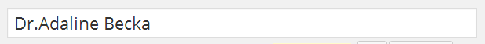
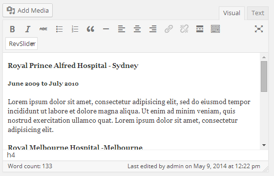
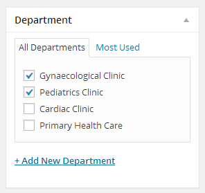
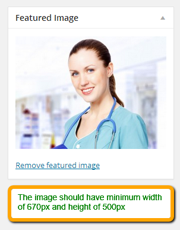
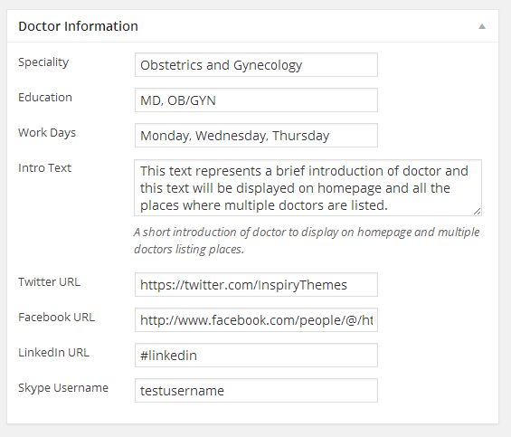

Go to **Dashboard** &raquo; **Doctors** &raquo; **Add New**

1. Provide the doctor name

2. Enter the text contents about doctor

3. Select or Add the related department

4. Provide the featured image. The image should have minimum width of 670px and minimum height of 500px

5. Provide the doctor related information in **Doctor Information** meta box

6. Publish the doctor post once it is ready.