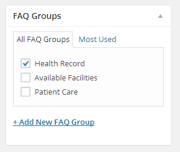
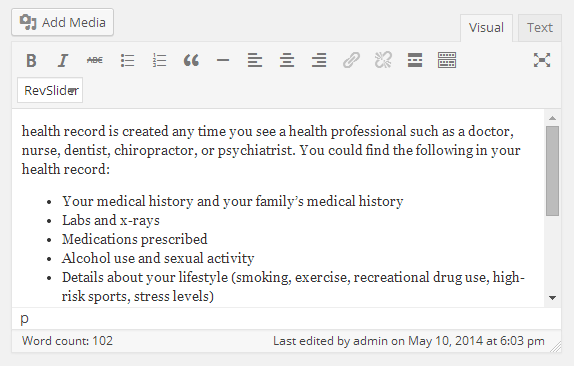

Go to **Dashboard &raquo; &raquo; **MedicalPress** FAQs &raquo; Add New**

1. Provide the question text in title field

2. Select or add a new FAQ Group.

3. Provide the Answer text as contents.

4. **Publish** the FAQ once it is ready.