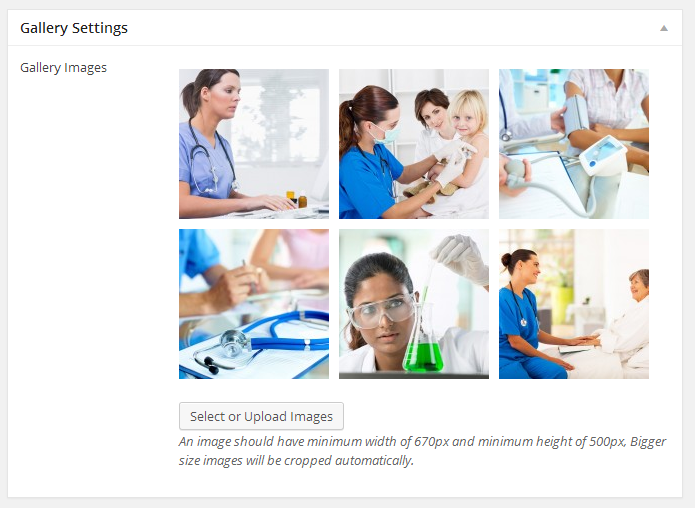
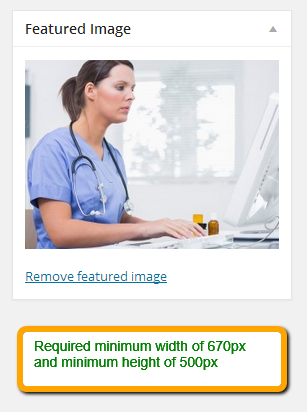
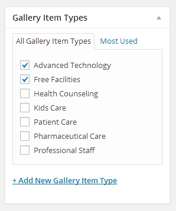
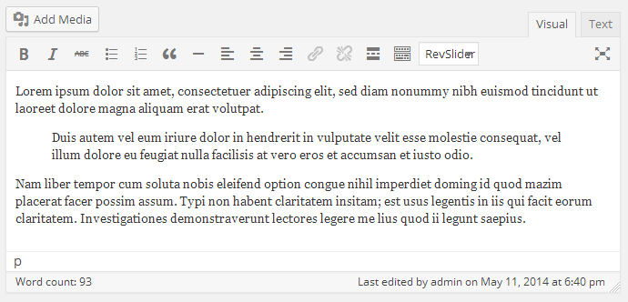

Go to **Dashboard** &raquo; **Gallery Items** &raquo; **Add New**

1. Provide the gallery item name

2. Upload the gallery images in **Gallery Settings** meta box. An image should have **minimum width of 670px and minimum height of 500px**

3. Provide the featured image. It is better to choose the one image from already uploaded gallery images. The image should have **minimum width of 670px and minimum height of 500px**

4. Select or Add a new Gallery Item Type

5. Enter the text contents about gallery item if you want to.

6. **Publish** the gallery item once it is ready.