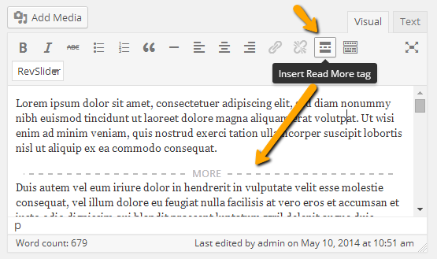

Go to **Dashboard** &raquo; **Posts** &raquo; **Add New**

!!! info "Post Formats and Related Meta Boxes"
    This theme supports various post formats. So, when you select a post format look out for related meta boxes that will appear after your selection. You need to fill out those meta boxes with related information, so that your post can appear in best possible design.

1. Provide the post title

2. Select the related post format

3. This theme is fully supported with latest gutenberg block editor and all basic elements. Enter the post contents if any and add MORE tag after few lines.

4. Provide the featured image. The image should have minimum width of 732px. Its height is flexible so you can upload the image of any height.

5. Publish the post once it is ready.