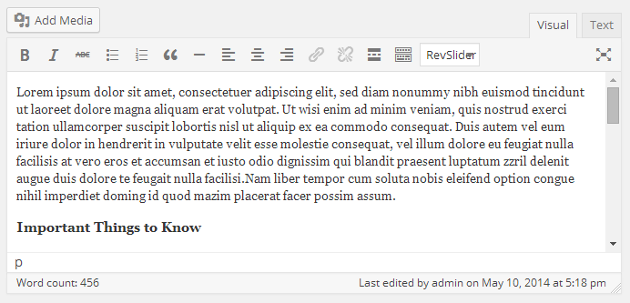
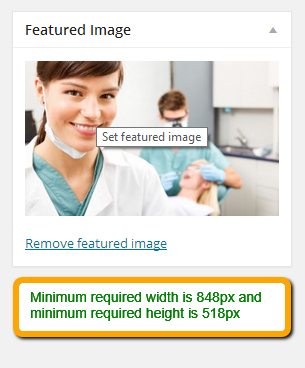

Go to **Dashboard** &raquo; **Services** &raquo; **Add New**

1. Provide the service name

2. Enter the text contents about service

3. Provide the featured image. The image should have **minimum width of 848px and minimum height of 518px**

4. **Publish** the service once it is ready.