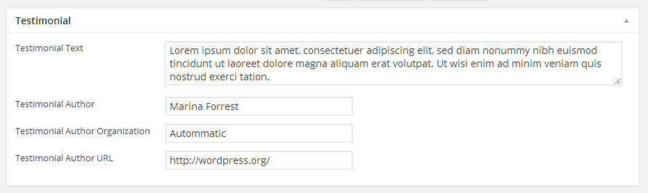

Go to **Dashboard** &raquo; **Testimonials** &raquo; **Add New**

1. Provide the patient name

2. Provide the featured image. The image should have minimum width of 130px and minimum height of 130px

3. Provide the testimonial related information in **Testimonial** meta box

4. **Publish** the testimonial once it is ready.