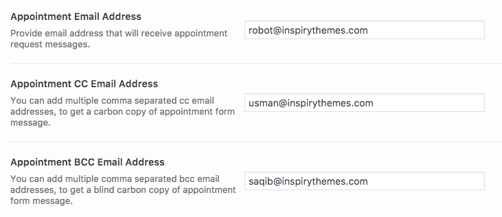
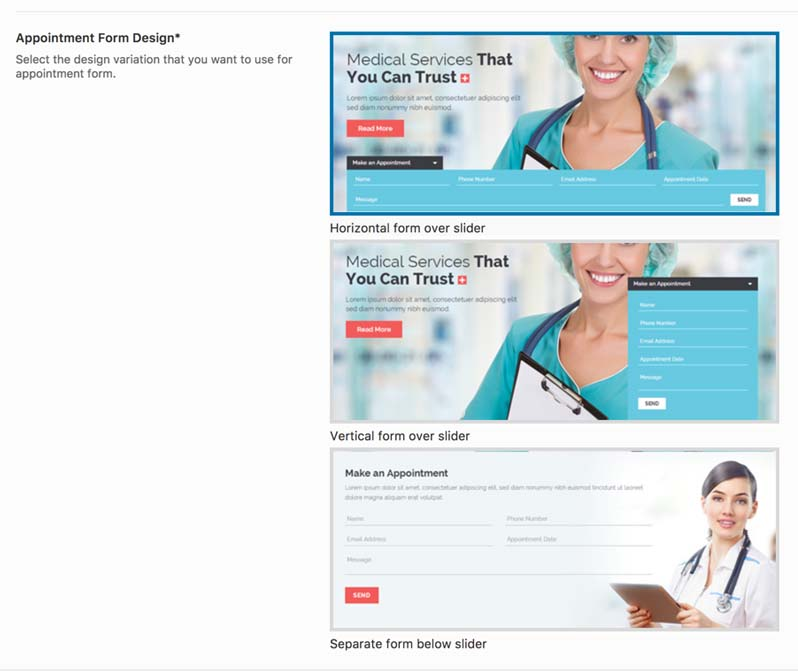
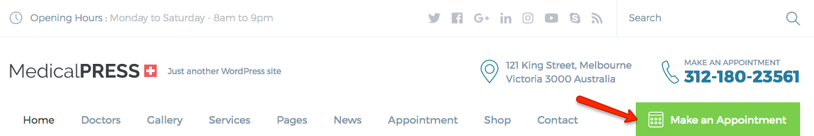
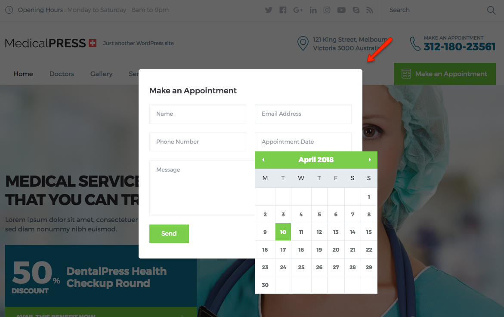
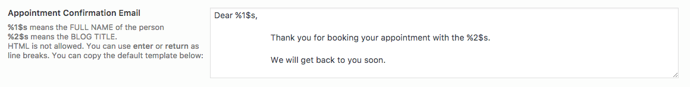
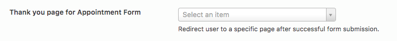
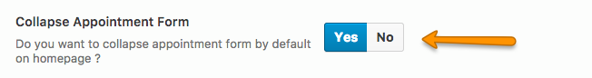
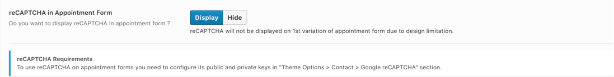

# Setup Appointment Form

1. To set up **Appointment Form** visit **Dashboard** &raquo; **MedicalPress** &raquo; **Theme Options** &raquo; **Home** and enable the appointment form as pointed in screen shot below.

2. After that you need to provide your email address to receive appointment request messages. You can also add more emails in BCC or CC input email fields, if there are multiple emails to be added then put comma ( , ) after each email except the last one.
 ------------------------------------------------------------------------------------------------------------------------------------------------
 **Note:** The appointment form will not be displayed if the email field is empty.
 ------------------------------------------------------------------------------------------------------------------------------------------------

    
3. After setting up above mentioned mandatory fields you can choose the **Appointment Form Design** that you want to use and provide the related information.
 ------------------------------------------------------------------------------------------------------------------------------------------------
 **Note:** The following design variations are only available for **Default** design variation.
 ------------------------------------------------------------------------------------------------------------------------------------------------

The appointment form for **Reborn** design variation will be available as modal.

4. Since version 1.6.0, we have added an option for "**Appointment Confirmation Email**" which allows our clients to customize the appointment confirmation email.

5. From version 1.6.0, Thank you page option for appointment form is added which adds a redirect function in the appointment form and the users will be redirected to the selected page after successful submission.

6. You can also choose to **Collapse the Appointment Form by Default** on homepage. If you will choose **YES** for this option then the appointment form will be hidden by default and the user will have to click on its heading to bring it up.

7. For spam protection we offer **google reCaptcha** support that you can enable for your home page appointment form as well.

You can read more about it by going to reCaptcha setup option. Please see the [reCaptcha Config](google-recaptcha.md) for further details.