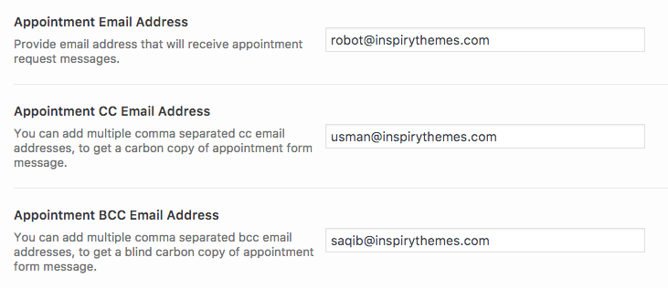

# Add Appointment Page

Go to **Dashboard &raquo; Pages &raquo; Add New**

1. Provide the page title

2. Select **Appointment Template** from page attributes &raquo; template.

3. Enter text contents.

4. **Publish** the page once it is ready.
!!! info ""
    The appointment form will not work unless you provide appointment email address in related theme options. **Dashboard &raquo; Theme Options &raquo; Home**

After publishing you need to add the newly created page in menu from.

**Dashboard** &raquo; **Appearance** &raquo; **Menus**