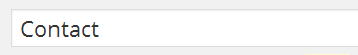
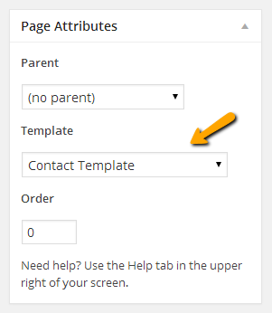
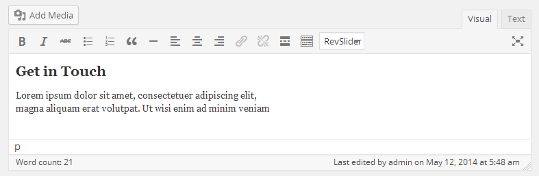
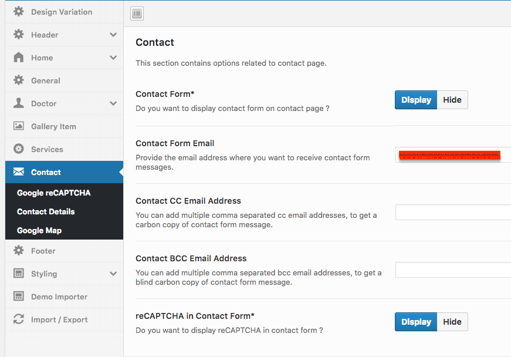

# Add Contact Page

Go to **Dashboard &raquo; Pages &raquo; Add New**

1. Provide the page title

2. Select **Contact Template** from page attributes &raquo; template.

3. Enter text contents.

4. **Publish** the page once it is ready.

To configure the contact form, contact details, social icons and google map go to
**Dashboard &raquo; Theme Options &raquo; Contact**
!!! info ""
    The contact form will not work unless you provide contact email address in related theme options.

After publishing and configuring related theme options, you need to add the newly created page in menu from **Dashboard** &raquo; **Appearace** &raquo; **Menus**