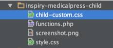

# How to Modify Styles

There are various options available to modify styles in this theme.

1. **Theme Options** - Go to **Theme Options** &raquo; **Styling** for various styling options.

2. **Quick CSS** - Go to **Theme Options** &raquo; **Styling** &raquo; **Quick CSS** to write some short css.

3. **Child Theme Custom CSS:** **child-custom.css** file is provided in child theme to add major css changes.

4. **Parent Theme Custom CSS:** If you are not using child theme then **common/css/custom.css** file is provided in parent theme to add major css changes.
