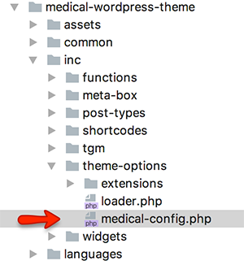
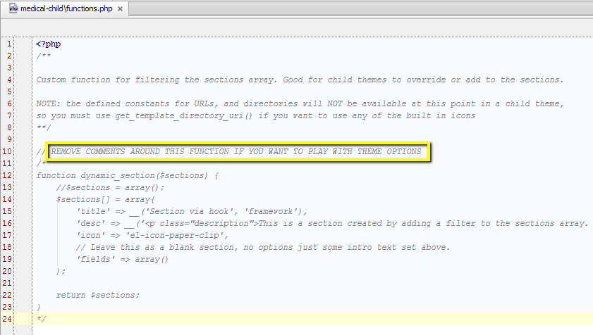

# Modify Theme Options

This theme uses [redux framework](http://reduxframework.com/) for theme options and related file reside in **inc  &raquo; theme-options &raquo; medical-config.php**

If you want to modify theme options from child theme then you need to open the **functions.php** file in child theme and remove the comments around function named **dynamic_section**

Now, you can consult redux framework [documentation](http://docs.reduxframework.com/) to learn about adding new sections and fields into theme options.
