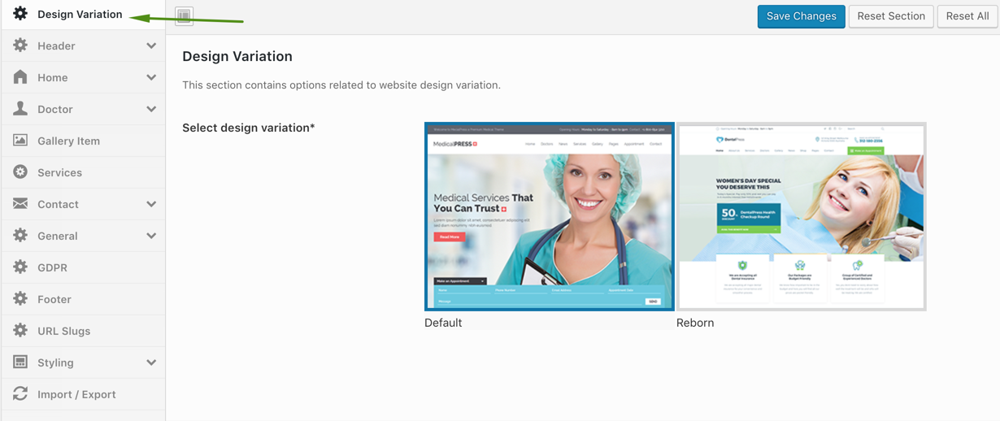

# Design Selection (Default or Reborn)

MedicalPress Theme offers two completely different design variations named **Default** and **Reborn**. We recommend you to decide a design variation in start and keep it for long term.

Please note that there could be more than one minor feature differences between both design variations due to design limitations.

To select design variation, Go to **Dashboard** &raquo; **Theme Options** &raquo; **Design Variation**.

Select the your desired design and **Save Changes**.