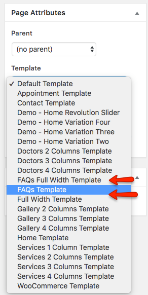
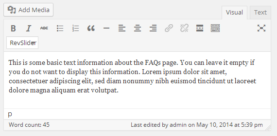

# Add FAQs Page

Go to **Dashboard &raquo; Pages &raquo; Add New**

1. Provide the page title

2. Select the appropriate page template for FAQs page.
There are 2 templates for FAQs page.

3. Enter some text contents if you want to.

4. **Publish** the page once it is ready.

5. After publishing you need to add the newly created page in menu from **Dashboard** &raquo; **Appearance** &raquo; **Menus**