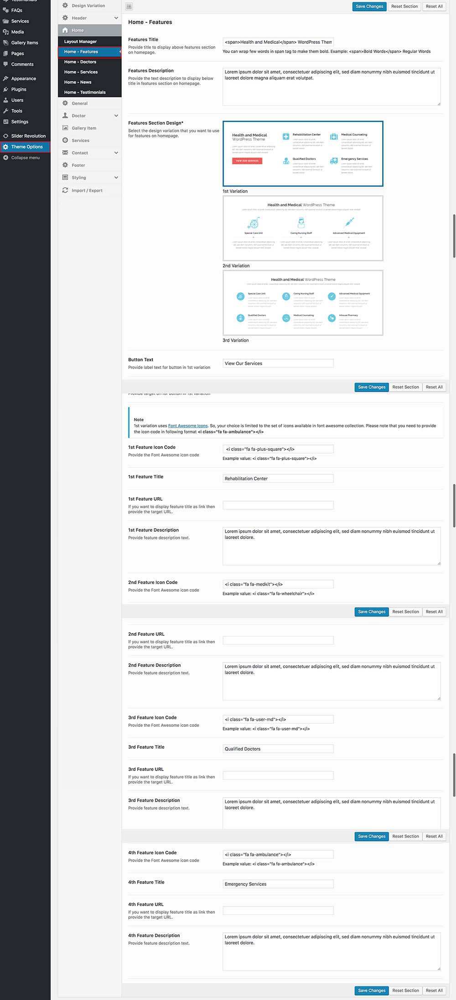

# Home Features Section

To set up features section, Go to **Dashboard** &raquo; **Theme Options** &raquo; **Home** &raquo; **Home - Features** and configure the related options.

### Home Features Options for Default Design Variation 

!!! info "Feature Icons"
    Feature icons for 2nd and 3rd variation can be found in **images/features-icons/** folder in **inspiry-medicalpress** folder.
    
    

### Home Features Options for Reborn Design Variation 

 
   
    