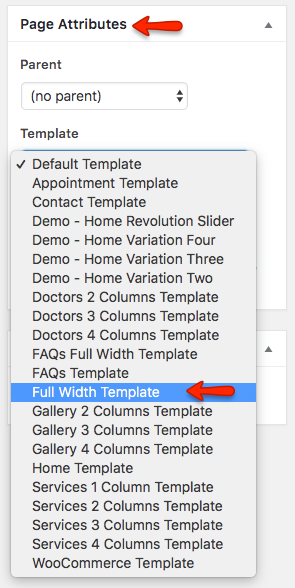

# Add Full Width Page

Go to **Dashboard &raquo; Pages &raquo; Add New**

1. Provide the page title

2. Select **Full Width Template** from page attributes

3. Enter text contents.

4. **Publish** the page once it is ready.

5. After publishing you need to add the newly created page in menu from **Dashboard** &raquo; **Appearance** &raquo; **Menus **