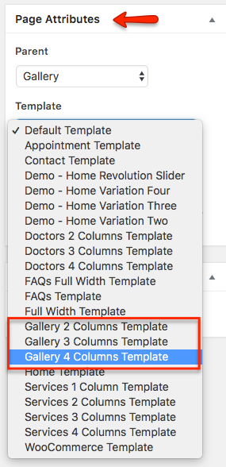

# Add Gallery Page

Go to **Dashboard** &raquo; **Pages** &raquo; **Add New**

1. Provide the page title

2. Select the appropriate page template for gallery.
There are 3 templates for gallery page.
    1. 2 Columns Gallery Template
    2. 3 Columns Gallery Template
    3. 4 Columns Gallery Template

3. **Publish** the page once it is ready.

4. After publishing you need to add the newly created page in menu from **Dashboard** &raquo; **Appearance** &raquo; **Menus **