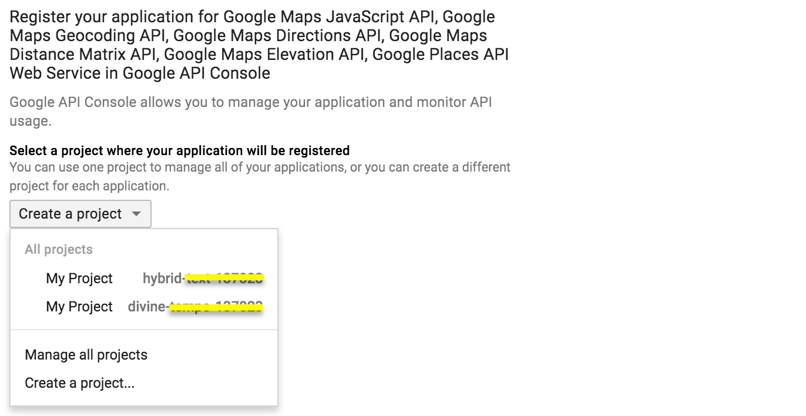
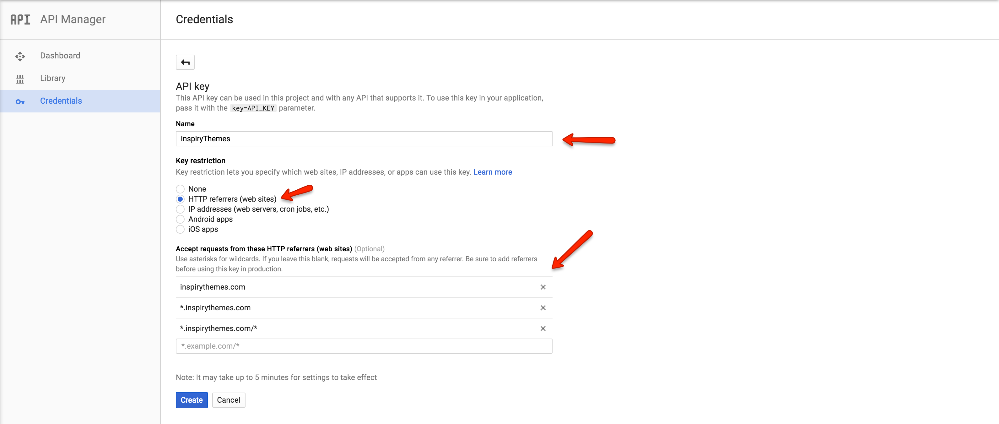
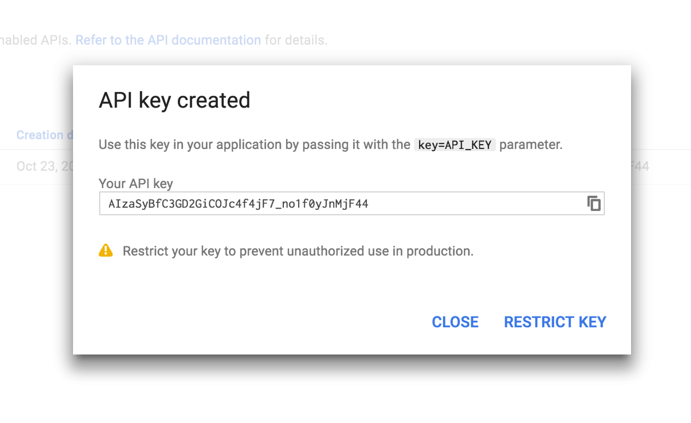
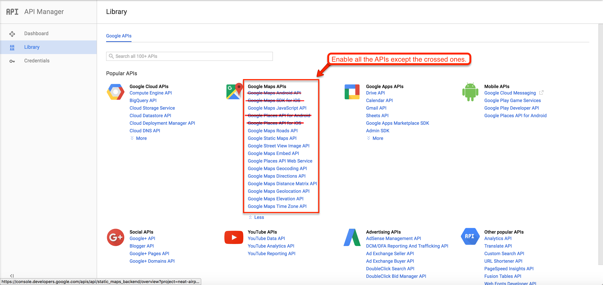
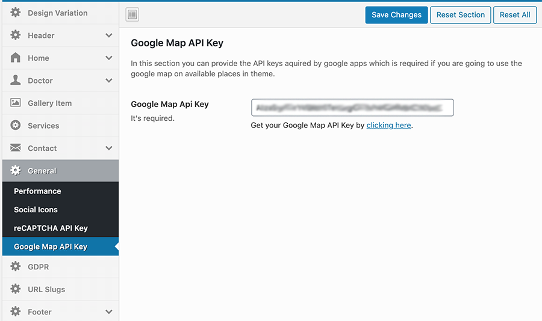

## How to get Google Maps API Key for your website

!!! info
    As of June 2016, to keep Google Maps running smoothly on your website you need a special API Key. To get and setup the API Key for Google Maps please follow the instructions below.

1. Please go to [Google API Console](https://console.developers.google.com/flows/enableapi?apiid=maps_backend,geocoding_backend,directions_backend,distance_matrix_backend,elevation_backend&amp;keyType=CLIENT_SIDE&amp;reusekey=true) and login with your google account.

2. Create a new project or select an existing project then click on **Continue** to enable the API and any related services.

3. Name your browser key and restrict it by adding your site URLs as shown in the screenshot below.

4. Copy the generated Google Maps API key from the popup, you will need this to set in **Theme Options** panel (**Dashboard** &raquo; **Theme Options** &raquo; **Contact** &raquo; **Google Map Api Key**). Click on **Close** button to proceed.

5. By default most of the APIs are enabled but you have to enable all other APIs too in order to avoid any problems in the future.

6. You need to enter this key in related place in **Theme Options > General > Google Map API Key** as seen in the following screenshot.

## How to verify domain with Google

Visit this link to [verify domain with Google](https://support.google.com/webmasters/answer/35179)