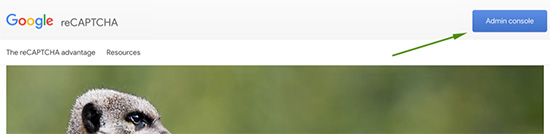
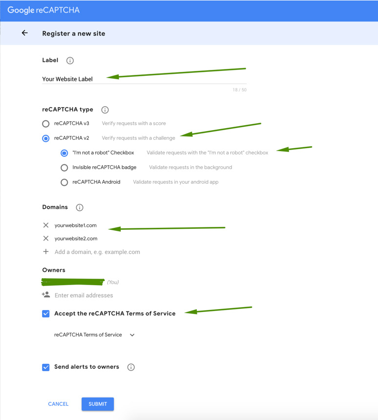
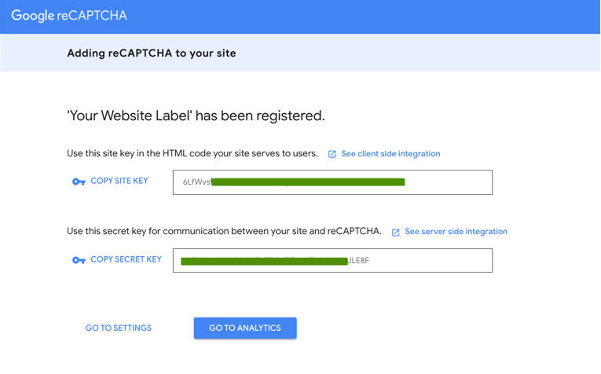
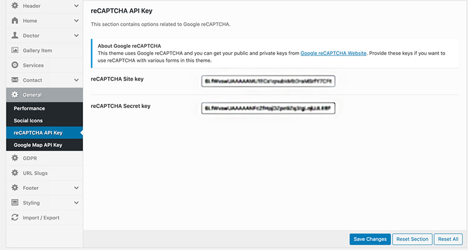

## How to get Google reCaptcha API Key for your website

This theme uses Google reCaptcha for spam safety. You need to provide public and private keys if you want to use reCAPTCHA with appointment and contact forms in this theme. You can obtain these keys by following the steps given below.

1. Click on the [Get reCaptcha Api Keys](https://www.google.com/recaptcha/intro/index.html) link. Click on the "Admin Console" button on the top right and login with your google account.

2. Provide the label of this API key pare and select reCaptcha V2 from the given options. You also need to provide the website domain names on which you want to use this api key. It will not work on any domain other than the given ones. After that click the terms and conditions checkbox and submit the form.

3. In the next page you can see the site and secret keys as seen in the following screenshot. You can copy and save those in a safe place.

4. You can copy those keys in the related fields as seen in the following screenshot.
