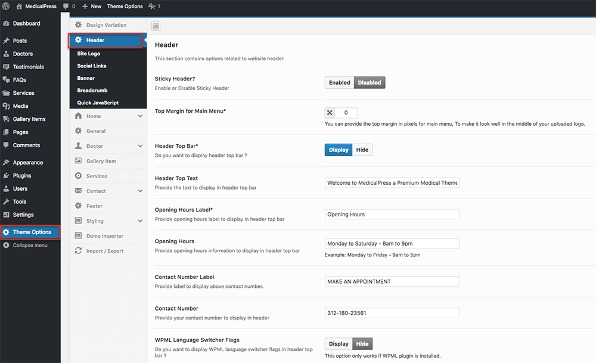
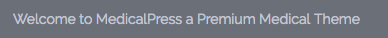
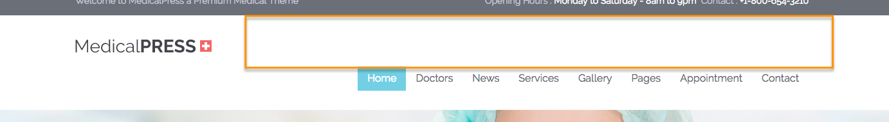
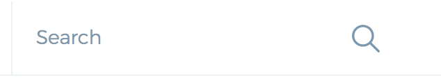
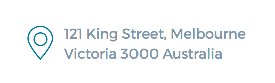

# Configure Header Settings

To configure header related settings kindly navigate to **Dashboard** &raquo; **Theme Options** &raquo; **Header** and configure the options according to your choice.

### Default Variation Specific Header Options 

Following options are available only in **<em>Default</em>** design variation.

#### Sticky Header
You can check the sticky header in the following video (look at the top header which is fixed and doesn't disappear on scroll the page up and down).

<iframe src="https://player.vimeo.com/video/230425776?autoplay=1&loop=1&title=0&byline=0" width="850" height="497" frameborder="0" webkitallowfullscreen mozallowfullscreen allowfullscreen></iframe>

#### Header Text

#### WPML Language Switcher

#### Top Margin for Main Menu

### Reborn Variation Specific Header Options 

Following options are available only in **<em>Reborn</em>** design variation.

#### Social Links

#### Search Box

#### Contact Address
