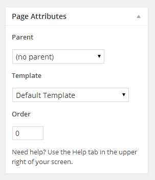

## Create Home Page

!!! info "Info"
    In case of imported XML the home page is already created and you do not need to follow this section.

To set up the Home page you need to create a new page,
Go to **Dashboard** &raquo; **Pages** &raquo; **Add New**.
You can give this page a title &quot;Home&quot; yet you do not need to include any contents for now.

Select the “**Home Template**” template from the Page Attributes section, as displayed in screen shot below and click **“Publish”**.

## Create News Page

!!! info "Info"
    In case of imported XML the news page is already created and you do not need to follow this section.

To set up the News page you need to create a new page,
Go to **Dashboard** &raquo; **Pages** &raquo; **Add New**. 
You can give this page a title &quot;News&quot; yet you do not need to include any contents for now.

Select the “**Default Template**” template from the Page Attributes section, as displayed in screen shot below and click **“Publish”**.

## Configure Reading Settings
I am assuming that you have imported the XML successfully and you have home page and news page available for use. 
If this is not the case then simply create a new page using **Home Template** and name it as Home after that create another page using default template and name it as News.

To configure reading settings you need to visit **Dashboard** &raquo; **Settings** &raquo; **Reading** and choose that front page displays as static page. Then select Home as Front Page and News as Posts Page. As, displayed in screen shot below.

## Configure Permalink Settings
To configure permalink settings visit **Dashboard** &raquo; **Settings** &raquo; **Permalinks** and configure it as displayed in image below.

