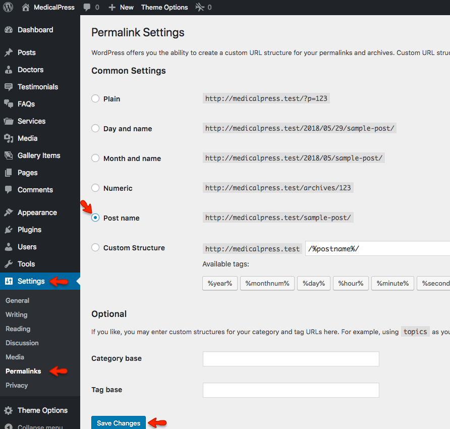
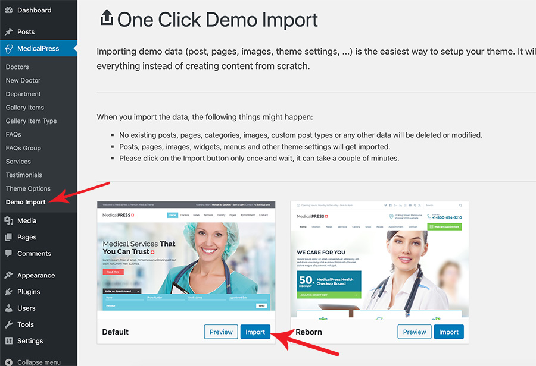
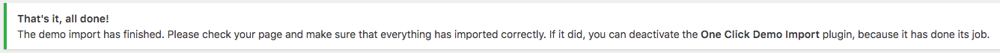

You can follow one of these approaches.

- One Click Demo Import **( Automatic & Recommended )**
- Import XML for Demo Contents

!!! warning "Note"
    Just make sure all the required plugins are installed.

## 1 - One Click Demo Import (Automatic & Recommended)

### **a. Set Permalinks**

Go to **Dashboard → Settings → Permalinks** and choose Post name from Common Settings and save the changes, As displayed in screen shot below.



### **b. Demo Import**

Go to **MedicalPress → Demo Import** and click on blue **Import** button of selected design variation. You will see a popup so click on the blue **Yes, import!** button again to confirm the import for the relevant layout of the theme. Wait for few minutes as the demo images are being fetched from the remote server and this process can take a couple of minutes.



### **c. Import Done Notice**

Once the import process is complete, You will receive a notice like the one displayed in the screenshot below.



Visit your site and you will find your site working like the theme demo. In case of any problem, Get in touch with our support team using our [support](https://support.inspirythemes.com/) site.

## 2 - Import XML for Demo Contents

!!! info "Info"
    You do not need to follow this section if you have already imported demo contents using **One Click Demo Import** feature.
    
### **a. Set Permalinks**

Go to **Dashboard → Settings → Permalinks** and choose Post name from Common Settings and save the changes, As displayed in screen shot below.


### **b. Install WordPress Import Plugin** 

Go to the **Dashboard** &raquo; **Tools** &raquo; **Import** and click Install Now shown under WordPress as displayed in image below.


Once installed you need to activate the plugin and run the importer.


### **c. Upload and Import XML file** 

Select the XML file from **demo** directory under **Import XML** directory in unzipped package that you have downloaded from themeforest.


After importing XML file.

1. Assign posts to an existing author.
2. Mark the checkbox to download and import file attachments
3. Click '**Submit**' button


After that is done, you will have bunch of posts, pages, doctors, gallery items, services and other contents as on the theme demo.


### **d. Set Menus** 

Navigate to **Dashboard** &raquo; **Appearance** &raquo; **Menus** and use the Already Imported Menu from XML and assign it to theme location "Main Menu" from **Menu Settings** section below menu. After that save the menu. As pointed in screenshot below.


### **e. Theme Options** 

#### Import Theme Options
 
 There are two ways to import demo theme options.

#### 1st Way - Import from File

1. Go to **Dashboard** &raquo; **MedicalPress** &raquo; **Theme Options** &raquo; **Import/Export**
2. Click '**Import from file**' button, It will display an import text box.
3. Look for selected design variation Theme Options file into the **Import Theme Options** folder in unzipped package downloaded from themeforest
4. Open the file in a text editor and copy all its contents.
5. Paste all those contents into import text box as displayed below.
6. Press '**Import**' button
7. Press '**Save Changes**' button once the theme options are imported.


#### 2nd Way - Import from URL

1. Go to **Dashboard** &raquo; **MedicalPress** &raquo; **Theme Options** &raquo; **Import/Export**
2. Click '**Import from URL**' button
3. Copy the import URL given below and paste it into the URL field 
4. Press '**Import**' button
5. Press '**Save Changes**' button once the theme options are imported.


**Import URL for Default Design Variation**
```py
http://medicalpress-min.inspirydemos.com/wp-admin/admin-ajax.php?action=redux_download_options-redux_demo&secret=efc7c4f980e586fd8514065e994f403b
```
**Import URL for Reborn Design Variation**
```py
http://medicalpress-reborn-min.inspirydemos.com/wp-admin/admin-ajax.php?action=redux_download_options-redux_demo&secret=87e71739a64960e1e65b97eac20c4139
```

