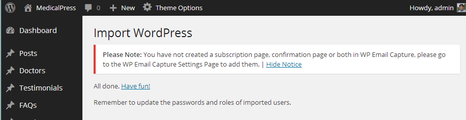
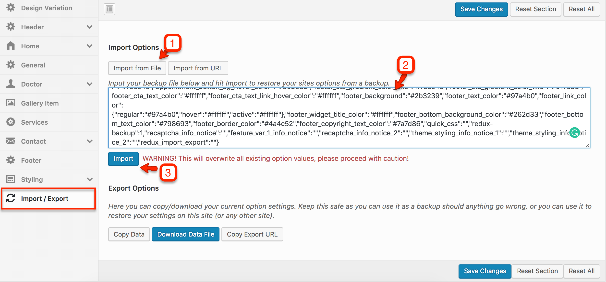

## Auto Import Demo Contents

Demo Importer will help you setup your site like the theme demo, with only one click.

!!! warning "Note"
    Just make sure all the required plugins are installed.

Go to **Dashboard** &raquo; **Theme Options** &raquo; **Demo Importer** and press **Import Demo** button, As pointed in screen shot below.


**Now wait, It can take few minutes as images are fetched from remote server.** You can visit your site once done.

Some time import process can become freezed/halted due to delays in fetching data from remote server.
You can verify this by visiting media library in a new tab and analysing the number of images imported.

In this case, Simply refresh theme options and re-click the demo import button as it will not add duplicate entries
and simply resume from where it halted last time. It only adds duplicate entries in menu and those can be removed easily.

For any further help you can create a support ticket on our [Support](https://support.inspirythemes.com/) site.

## Import XML for Demo Contents

!!! info "Info"
    You do not need to follow this section if you have already imported demo contents using **Auto Import Demo Contents** feature.

Importing demo contents and making your site one step closer to the theme demo requires following steps.

1. Importing XML file
2. Configuring Menus

Look for **Import XML** folder in unzipped package downloaded from themeforest and use the XML within it.
Go to the **Dashboard** &raquo; **Tools** &raquo; **Import ** and click **WordPress** as displayed in image below.


At 1st time you need to install WordPress importer plugin


Once installed you need to activate the plugin and run the importer.


Select the XML file from **demo** directory under **Import XML** directory in unzipped package that you have downloaded from themeforest.


After importing XML file.

1. Assign posts to an existing author.
2. Mark the checkbox to download and import file attachments
3. Click '**Submit**' button


After that is done, you will have bunch of posts, pages, doctors, gallery items, services and other contents as on the theme demo.



Next step is to configure menu.

## Configure Menus
Navigate to **Dashboard** &raquo; **Appearance** &raquo; **Menus** and use the Already Imported Menu from XML and assign it to theme location "Main Menu" from **Menu Settings** section below menu. After that save the menu. As pointed in screenshot below.


## Import Theme Options

There are two ways to import demo theme options.

### 1st Way - Import from File

1. Go to **Dashboard** &raquo; **Theme Options** &raquo; **Import/Export**
2. Click '**Import from file**' button, It will display an import text box.
3. Look for file named "**demo-theme-options-for-import.txt**" into **Import Theme Options** folder in unzipped package downloaded from themeforest
4. Open the file in a text editor and copy all its contents.
5. Paste all those contents into import text box as displayed below.
6. Press '**Import**' button
7. Press '**Save Changes**' button once the theme options are imported.



### 2nd Way - Import from URL

1. Go to **Dashboard** &raquo; **Theme Options** &raquo; **Import/Export**
2. Click '**Import from URL**' button
3. Copy the import URL given below and paste it into the URL field 
4. Press '**Import**' button
5. Press '**Save Changes**' button once the theme options are imported.

```py
http://medicalpress-min.inspirythemes.biz/wp-admin/admin-ajax.php?action=redux_download_options-redux_demo&secret=19a70075b0eb105a5530ed121e177ee9
```

