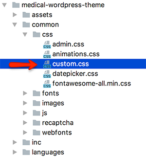
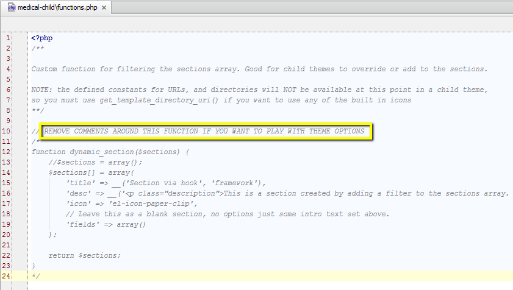

## Modify Styles

There are various options available to modify styles in this theme.

1. **Theme Options** - Go to **Theme Options** &raquo; **Styling** for various styling options.

2. **Quick CSS** - Go to **Theme Options** &raquo; **Styling** &raquo; **Quick CSS** to write some short css.

3. **Custom CSS in Child Theme** - **child-custom.css** file is provided in child theme to add major css changes.

4. **Custom CSS in Parent Theme** - if you are not using child theme then **css/custom.css** file is provided in parent theme to add major css changes.

## Modify Theme Options

This theme uses [redux framework](http://reduxframework.com/) for theme options and related file reside in **theme-options &raquo; medical-config.php**

If you want to modify theme options from child theme then you need to open the **functions.php** file in child theme and remove the comments around function named **dynamic_section**

Now, you can consult redux framework [documentation](http://docs.reduxframework.com/) to learn about adding new sections and fields into theme options.

## Modify Meta Boxes

This theme uses [Meta Box Plugin](https://wordpress.org/plugins/meta-box/) for meta boxes and related file reside in **meta-box &raquo; config-meta-boxes.php**

So, you can easily modify the code of existing meta boxes. Or you can add new meta boxes using **framework_theme_meta** filter in child theme.

## Hire Customization Services

If you need some additional features or want modification in existing theme features then you can contact us for
[theme customization service](https://inspirythemes.com/theme-customization/).