## Sticky Header

To enable sticky header go to **Dashboard** &raquo; **Theme Options** &raquo; **General** as pointed in image below.
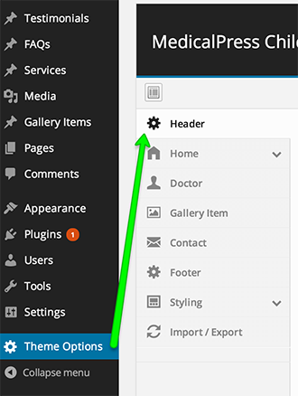

Look for the **Sticky Header** option in this section. Enable it and **Save Changes**.
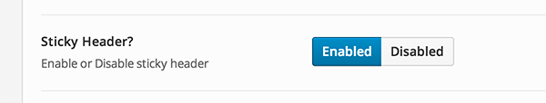

## Boxed Layout

To enable boxed layout of MedicalPress Theme please navigate to **Dashboard** &raquo; **Theme Options** &raquo; **General** as pointed in image below.
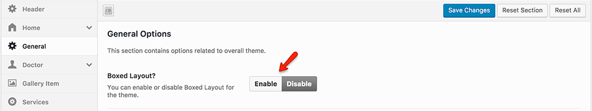

Look for the **Boxed Layout** option in this section. Enable it and **Save Changes**.

## Google reCAPTCHA

To configure Google reCAPTCHA you need to [Visit Google reCAPTCHA Site](https://www.google.com/recaptcha/intro/index.html) and get public and private keys for your website.
After that use those keys to fill the related fields in **Dashboard &raquo; Theme Options &raquo; Contact** as displayed below.
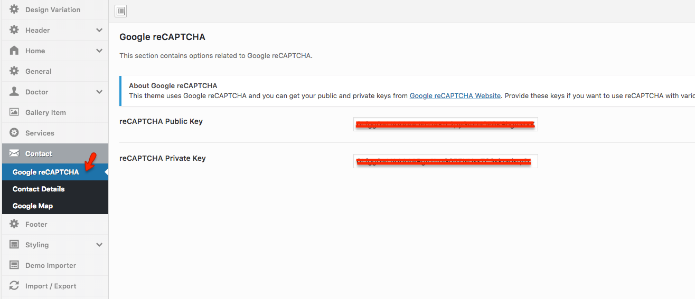

Now your reCAPTCHA keys are configured and you just need to enable reCAPTCHA on the required forms.

To enable it on **Contact Form**, look for **reCAPTCHA in Contact Form** option and enable it.
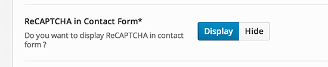

To enable it on **Appointment Forms**, Got to **Dashboard &raquo; Theme Options &raquo; Home** and look for **reCAPTCHA in Appointment Form***.
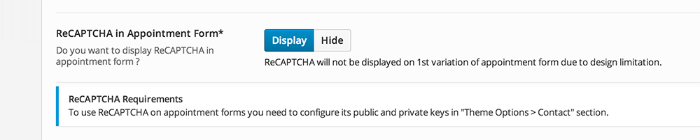

## Two Columns Menu

To display two columns dropdown menu ( sub-menu ), Simply add **two-col-menu** class to parent menu item. As displayed in screen shot below.
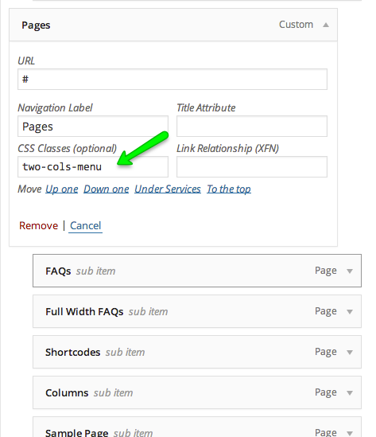

After that, your menu will look like this.
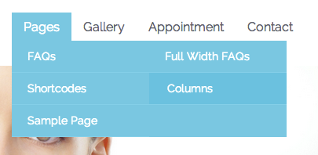

## Shortcodes

### Appointment Form

**Shortcode Example**
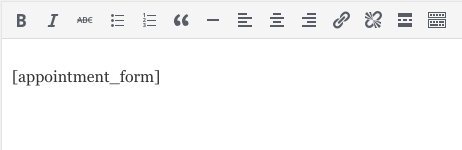

**Output Example**
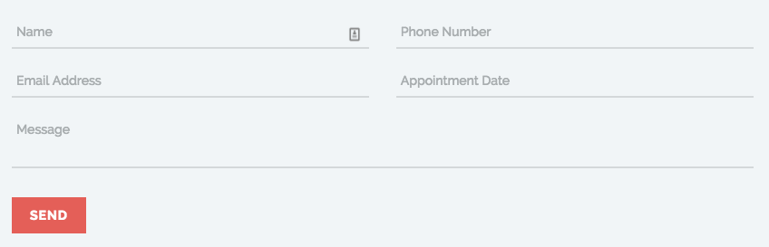

### Home News

**Shortcode Example**
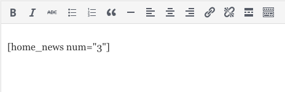

**Output Example**
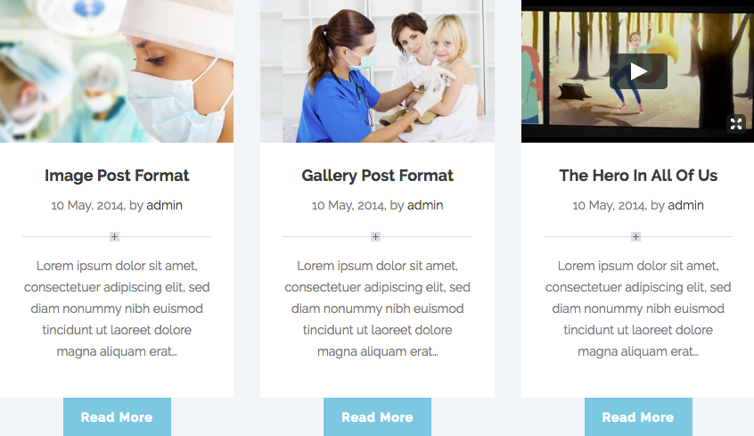

### Home Doctors

**Shortcode Example**
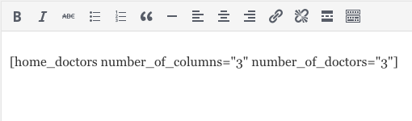

**Output Example**

### Add Specific Doctor

**Shortcode Example**
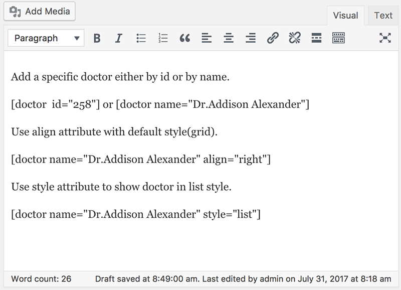

**Output Example**

### 1st List Style

**Shortcode Example**
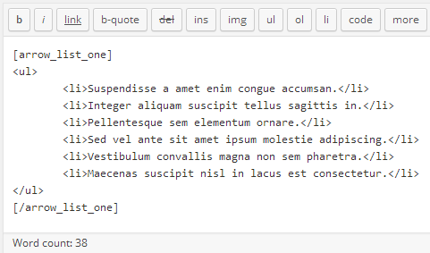

**Output Example**
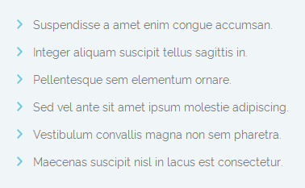

### 2nd List Style

**Shortcode Example**
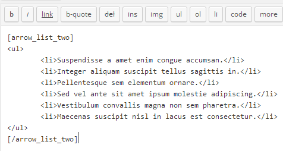

**Output Example**
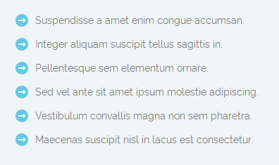

### 3rd List Style

**Shortcode Example**
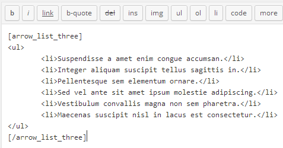

**Output Example**
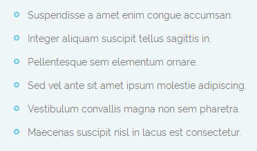

### Buttons

**Shortcode Example**
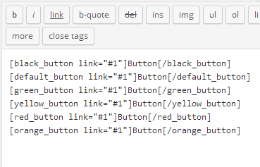

**Output Example**
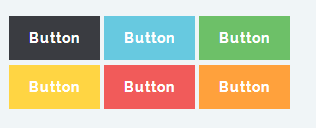

### Messages

**Shortcode Example**
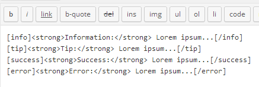

**Output Example**
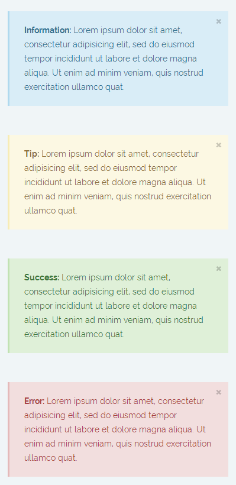

### Tabs

**Shortcode Example**
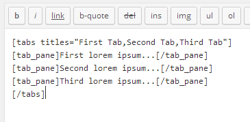

**Output Example**
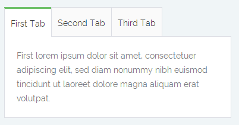

**Shortcode Example (Vertical Direction)**
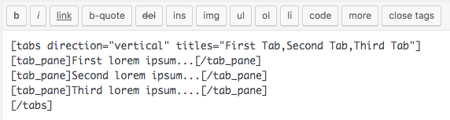

**Output Example**
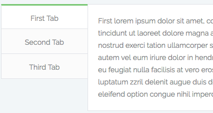

### Accordions

**Shortcode Example**
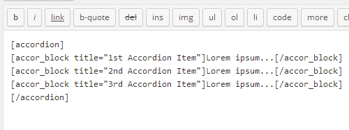

**Output Example**
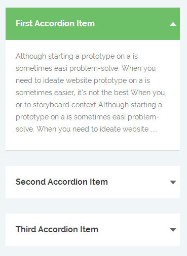

### Toggles

**Shortcode Example**
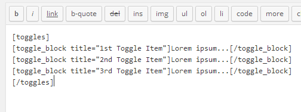

**Output Example**
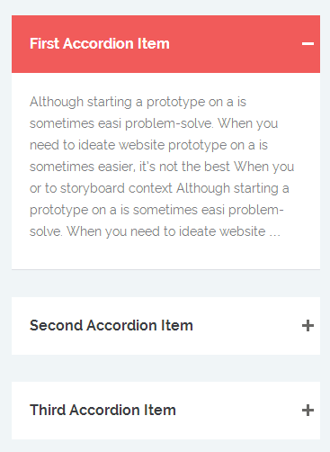

### Columns

**2 Columns Shortcode Example**

**3 Columns Shortcode Example**

**4 Columns Shortcode Example**

**6 Columns Shortcode Example**

**Mix Columns Shortcode Example**
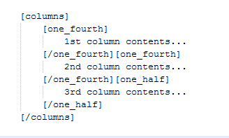

### vc_elements

Visual Composer Elements

**[home_news], [home_doctors]** and **[appointment_form]** shortcodes come integrated with visual composer and if you have installed and activated visual composer then you can use these shortcodes from visual composer **Add Element** panel as displayed in screenshot below.
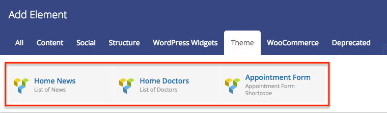

## Translating The Theme

This theme is translation ready but the support of RTL languages is not available for now.

1. For translation to only one language please visit [This Knowledge Base Article](https://support.inspirythemes.com/knowledgebase/how-to-translate-your-theme-to-your-language/)
2. For translation to multiple languages you can use [WPML Plugin](https://wpml.org/)