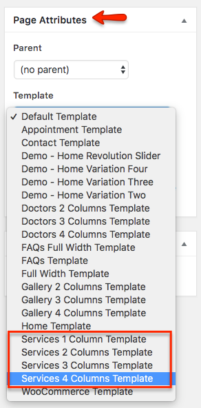

# Add Services Page

Go to **Dashboard &raquo; Pages &raquo; Add New**

1. Provide the page title

2. Select the appropriate page template for services.
There are 3 templates for services page.
    1. 1 Columns Services Template
    2. 2 Columns Services Template
    3. 3 Columns Services Template

3. **Publish** the page once it is ready.

4. After publishing you need to add the newly created page in menu from **Dashboard** &raquo; **Appearance** &raquo; **Menus **