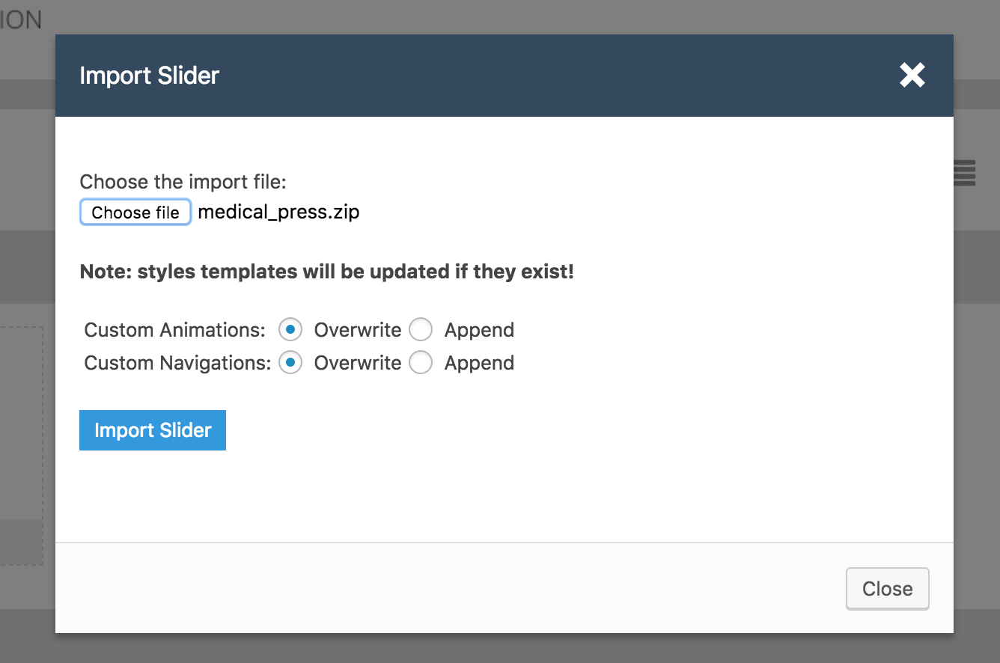

## Set Up Default Slider

To set up default slider visit **Dashboard** &raquo; **Theme Options** &raquo; **Home** and configure the related settings as pointed in screen shot below.

!!! info "Info"
    MedicalPress demo slider images are already imported with XML. So if you want, you can simply select those from Media Library to quickly test the theme in start.

After that you can start adding slides one by one as displayed in screen shot below.
Once you are done adding slides, save the theme options and visit the homepage to view the resulted slider.

### Announcement Display

!!! info "Info"
    This option is only available in "Reborn" Design Variation.

## Set Up Revolution Slider

To set up revolution slider you need to install revolution slider plugin that comes as part of the theme package and its files exits in **Plugins/Revolution Slider/** folder in the unzipped package.

1. Go to **Dashboard** &raquo; **Plugins** &raquo; **Add New** &raquo; **Upload**

2. Select the **revslider.zip** file from **Plugins/Revolution Slider/** folder and press **Install Now**

3. Activate the plugin after the install.

4. Now, Go to **Revolution Slider** and press import slider.

5. Upload **medical_press.zip** from **Plugins/Revolution Slider/Slider Import Zip/** folder and press **Import Slider**

6. Once done copy the alias **<em>medical_press</em>** and paste it into slider revolution related theme options.

7. Save the changes in theme options and visit home page to test revolution slider.

!!! info ""
    ####Can I use the theme purchase code to activate slider revolution?
    Theme purchase code cannot be used for slider revolution activation and slider revolution author do not allow the theme authors like me to provide the extended license purchase code for plugin as part of the theme download package.  
    So, if you need to update slider revolution automatically OR you need to get some support related to slider revolution then you have to purchase it separately.  
    I will always try to provide the latest version of slider revolution plugin with a theme update. So, I do not recommend you to purchase it separately.  
    Thanks.