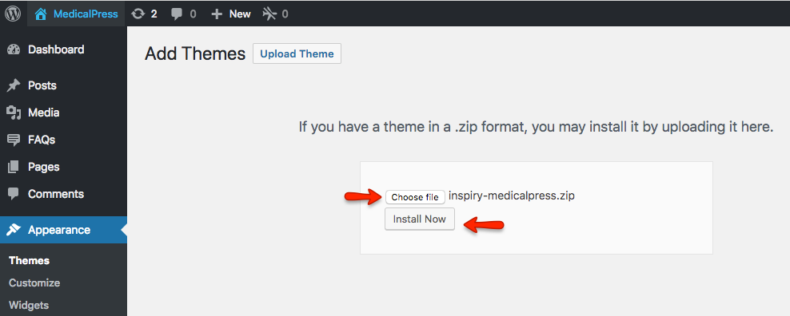
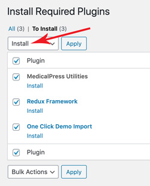
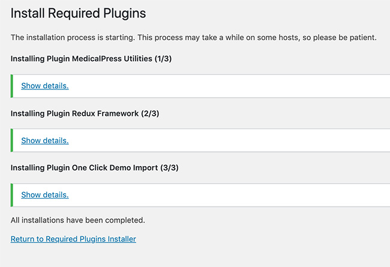
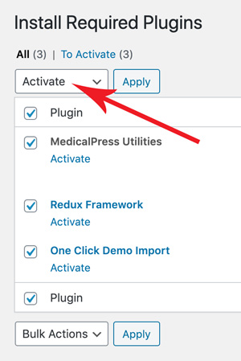

# Install Theme

In start you must have a working version of WordPress already installed. For information in regard to installing the WordPress CMS, please see the WordPress Codex [Installing WordPress](https://codex.wordpress.org/Installing_WordPress).
Once you have a working of version of WordPress, you need to download **All Files and Documentation** from themeforest and extract the downloaded zip to get various files including **inspiry-medicalpress.zip**.

## 1.Install Theme Via WordPress Dashboard (Recommended)
1.  Go to **Appearance** &raquo; **Themes** section
2.  Click **Add New** and select the **Upload Theme** option 
3.  Choose the **inspiry-medicalpress.zip** file and press **Install Now**
4.  Once the theme is uploaded you need to activate it.

!!! info "Info"
    if you face any problem during upload through dashboard, please upload the theme using FTP as guided below.

### Install Theme Via FTP (Alternative Way)

1.  Access your hosting server using an ftp client like [FileZilla](https://filezilla-project.org/FileZilla)
2.  Go to the **wp-content/themes** folder of your WordPress installation
3.  Extract the **inspiry-medicalpress.zip** file and put the **inspiry-medicalpress** folder in **wp-content/themes/** folder
4.  Go to **WordPress Dashboard** &raquo; **Appearance** &raquo; **Themes** section to activate the theme

## 2.Install Plugins

After you have installed and activated the theme, there'll be a list of **required** plugins at the top of the WordPress dashboard. 

If you already hide it out, you can go to **Appearance** &raquo; **Install Plugins** section instead. 

So, you need to install and activate these plugins as demonstrated below.

**Step 1**

**Step 2**

## 3.Install Child Theme (Highly Recommended)

It is better to use child theme as if you need to modify anything you modify in child theme only.
This way you can easily update your parent theme whenever new update becomes available on themeforest.
You can read more about child theme from [here](https://codex.wordpress.org/Child_Themes). 

To install child theme, you need to upload the **inspiry-medicalpress-child.zip** and activate it in the same way as you uploaded and activated the parent theme's **inspiry-medicalpress.zip**.