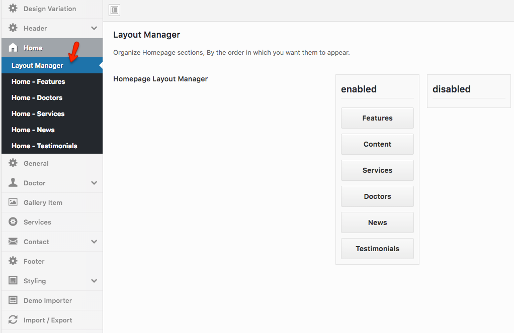
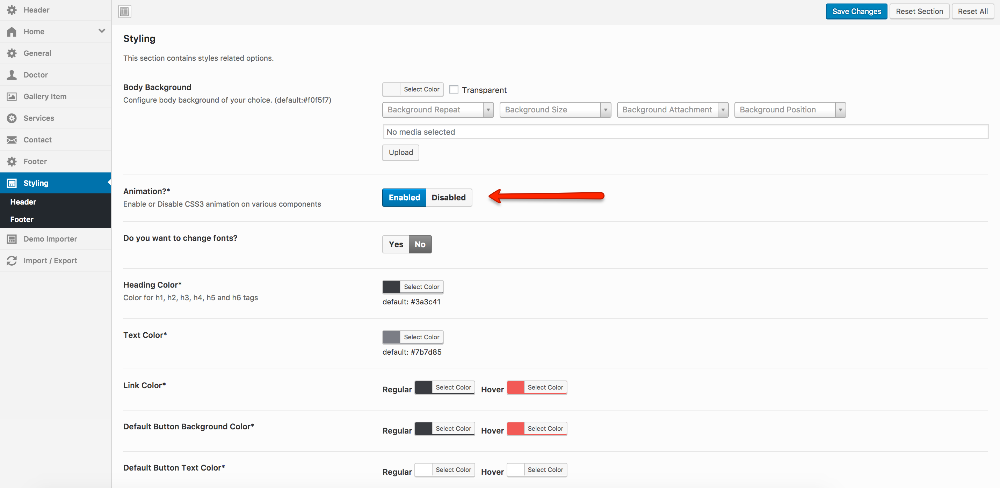
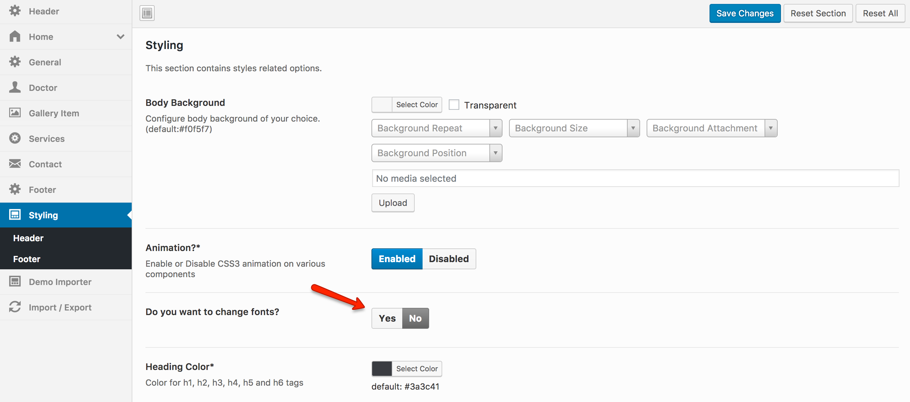
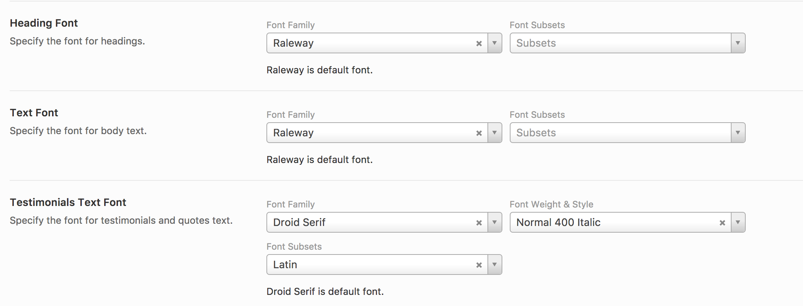

## Homepage Layout Manager

**Homepage Layout Manager** allows you to change the order of display of the elements on the home page. 
There are two clumns in layout manager, the left one is for enabled sections and the right one is for disabled elements.
You can drag from left to right and right to left to disable or enable any elements.

The **Homepage Layout Manager** can be found in **Dashboard** &raquo; **Theme Options** &raquo; **Home** and (scroll down to the end of the page) as displayed in the following screenshot.

## Disable Animation

You can disable the CSS3 Animation of MedicalPress Theme which you see everytime when you scroll down the home page.

1. Go to **Dashboard** &raquo; **Theme Options** &raquo; **Styling**.
2. Select **Disable** for the option which says **Animation** (displayed in the screenshot).

## Change Fonts

It is also possible to change fonts for MedicalPress Theme.

1. Go to **Dashboard** &raquo; **Theme Options** &raquo; **Styling**.
2. Select **Yes** for the option which says **"Do you want to change fonts?"** (displayed in the screenshot).

3. When you will select **Yes** then some new options will be displayed for you so that you can select different fonts for Heading Font, Text Font etc (shown in the screenshot).

