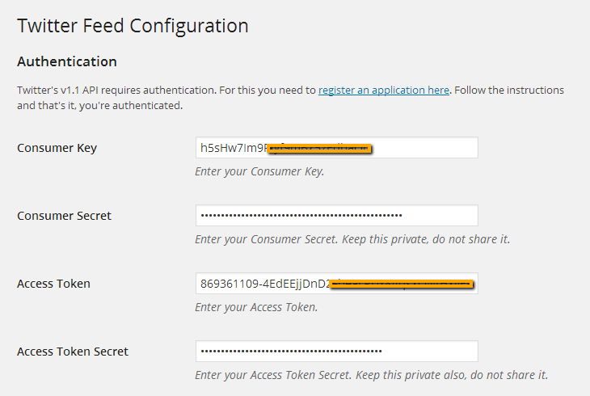
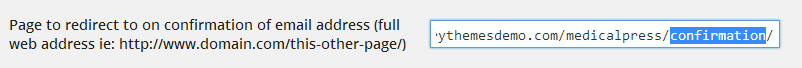
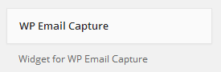
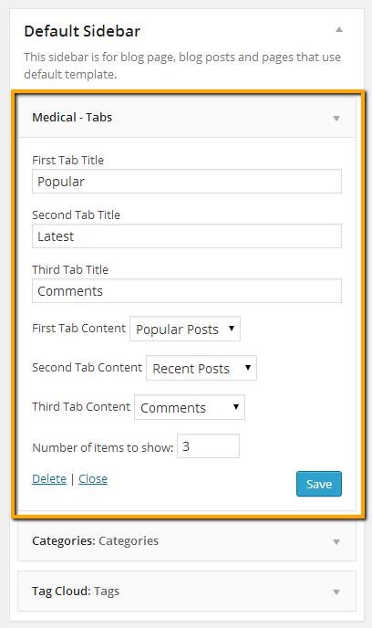

## Twitter Widget

Latest tweets widget uses [Display Tweets Plugin](https://wordpress.org/plugins/display-tweets-php/)
To set up twitter widget, Go to **Dashboard &raquo; Plugins &raquo; Installed Plugins**

1. Make sure the **Display Tweets** plugin is already installed. If it is not already installed then install it.

2. Now, you need the twitter app's consumer key, consumer secret, access token and access token secret for twitter authentication.
To get all these keys, You need to register a new twitter app from [following url](https://apps.twitter.com/app/new)
After registering app and generating access token you will have api keys and access token as displayed below

API Key is basically consumer key and API secret is consumer secret.

3. After installing and activating the plugin, Go to **Settings &raquo; Twitter Feed** and use the keys that you just got from twitter app.
Save the settings after configuring the keys and related options.

4. Now go to **Dashboard** &raquo; **Appearance** &raquo; **Widgets** and look for **Tweets** widget.

5. Use that tweets widget in a footer column. Provide it a title and save the widget settings.

6. Now check out the front end of your site and you will have a twitter widget working for your site.

## Newsletter Sign Up Widget

Newsletter sign up widget uses [WP Email Capture](https://wordpress.org/plugins/wp-email-capture/) Plugin
To set this widget, Go to **Dashboard &raquo; Plugins &raquo; Installed Plugins**

1. Make sure the **WP Email Capture** plugin is already installed. If it is not already installed then install it.

2. This widget requires two pages to work properly.
    1. **Thanks** page as displayed in [](http://inspirythemesdemo.com/medicalpress/thanks/This Link
    2. **Confirmation** page as displayed in [](http://inspirythemesdemo.com/medicalpress/confirmation/This Link
To learn about how to create a page visit the **Create Pages** &raquo; **Full Width Page** section of this documentation.

3. After installing and activating the plugin, Go to **Settings** &raquo; **WP Email Capture** and Provide the 'thanks' page URL in the 1st field

4. Provide the 'confirmation' page URL in the 2nd field

5. After that configure the related options and save the changes.

6. Now go to **Appearance** &raquo; **Widgets** and look for **WP Email Capture** widget.

7. Use that widget in a footer column. Provide it a title, widget text and save the widget settings.

8. Now check out the front end of your site and you will have the newsletter sign up widget working for your site.

## Tabs Widget

1. Go to **Dashboard** &raquo; **Appearance** &raquo; **Widgets** and look for **Medical - Tabs** widget.

2. Use that widget in sidebar. Provide the tabs titles and configure the related settings.

3. Save the widget settings after you are done.

4. Now check the front end of your site and you will have the tabs widget working in your site's sidebar.
