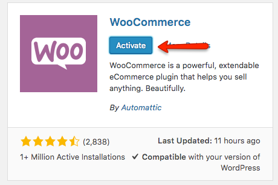
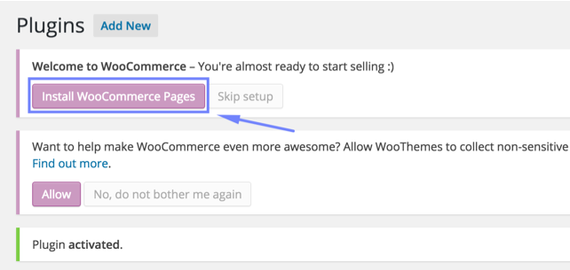
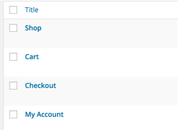
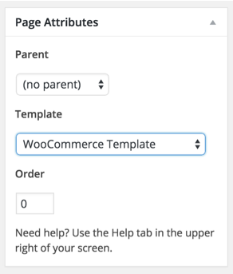
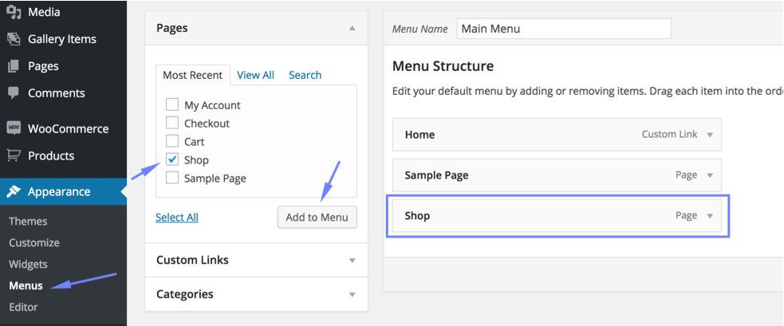

# How to set up WooCommerce Shop

This theme uses [WooCommerce](https://wordpress.org/plugins/woocommerce/) Plugin to provide shop related functionality.
Please follow the steps below to setup your shop.

1. Go to **Plugins &raquo; Add New** and search for **WooCommerce** and install it as displayed in screen shot below.

2. **Activate Plugin** once installed.

3. **Install WooCommerce Sample Pages** after plugin activation.

 It will add 4 pages (Shop, Cart, Checkout and My Account).

5. Edit & Update ( **Cart** page, **Checkout** page and **My Account** page ) one by one and assign **WooCommerce Template** as page template.

6. Go to **Appearance &raquo; Menus** and add Shop page into your desired menu. Save the menu after adding shop page.

Visit the shop page and you will find a message that no product is found.

7. Now, You can add your own products or you can import dummy data to play with basic stuff. 
To **Import Dummy Data** you can follow [this helping article](http://docs.woothemes.com/document/importing-woocommerce-dummy-data/).