### Basic Setup

!!! info
    I am assuming that you have a working version of WordPress with MedicalPress theme installed and configured based on the documenation and sample data provided with in the theme package.

Please follow the steps below to configure the basic settings for WPML Plugin.

1. Install and Activate **WPML Multilingual CMS** Plugin.

2. Go to **Dashboard** &raquo; **WPML** &raquo; **Languages**.

3. Select **English** as Current Language and **Go Next**.

4. Select the other languages for your site and **Go Next**.

5. Leave all the section on this page as it is and **Go Next**.

6. **Register WPML** if you want to receive automatic updates OR press "**Remind Me Later**" button.

7. Click **Finish** Button, Now you will be taken to **Dashboard &gt WPML &gt Languages** page but with different interface. If not then manually go to **Dashboard &gt WPML &raquo;Languages** Page.

8. Look for **Language URL Format** section and choose the url format that suites your needs.
I am choosing the 1st one with languages directories at the end. Save the changes.
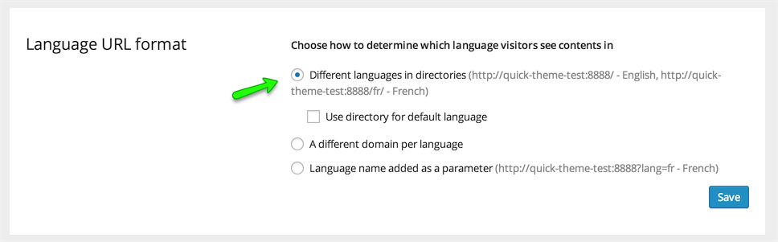

9. Look for **Language Switcher Options** section and then look for **What to include in the language switcher** option.
Choose to display Flag with in language switcher and save the changes. Leave all other options as it is.

10. Leave all other sections as it is.

11. Now, install and activate **WPML String Translation** plugin.
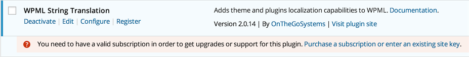

12. After that, go to **Dashboard &gt WPML  &gt Theme and Plugin Localization**.

13. 1st Option is **“Select how to translate strings in the theme and plugins”**, Choose **Translate the theme and plugins using WPML's String Translation** and Save.

14. Next Option is **“Select how to get translations for WordPress”**, Choose the 1st options **“WPML will automatically download translations for WordPress”** and save.
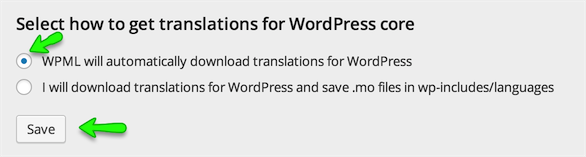

15. Skip the Option “**Language locale Settings**”.

16. Next Options is “**Strings in the Theme**”, Press the Scan the theme for Strings Button and Wait for results.
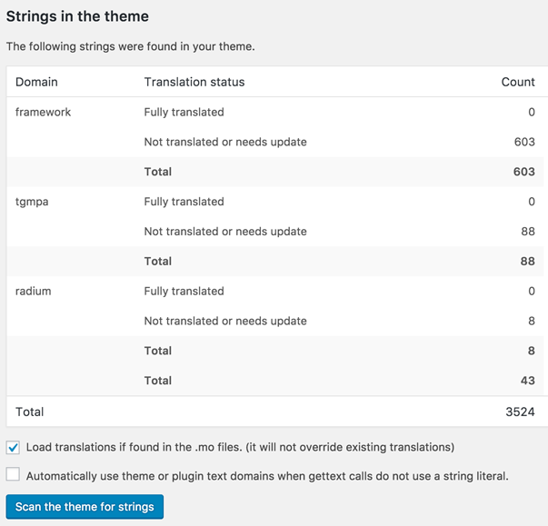

17. Now, Go to **Dashboard &gt WPML &gt String Translation** section and configure the following settings.
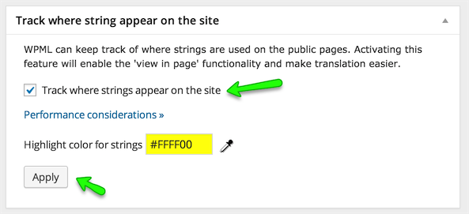

18. Basic settings are complete and you can translate a string that do not exist in post, pages and taxonomies using **Dashboard &gt WPML &gt String Translation** Section. For more information, please visit:
[https://wpml.org/documentation/getting-started-guide/string-translation/](https://wpml.org/documentation/getting-started-guide/string-translation/)

## Translate Home & News Page

### Duplicate Home Page

1. Go to **Pages** on Dashboard side and look for **Home** Page
2. Open the **Home** page for editing and look for **Language** meta box in right sidebar.
3. Select **Duplicate** in front of your desired other language. and press **Duplicate** button. The page will refresh.
**Note:** You can edit the duplicated page if you need to but we are not doing it here.
4. Now you can go to the Home page on front end ( visit the site ) and choose the translated home page's language from language switcher in header top bar and you will see that page will refresh and URL will be changed to your newly translated homepage.
**Note:** If you are not able to view language switcher then make sure to enable the setting in **Dashboard &gt Theme Options &raquo; Header** section as displayed in screen shot below.
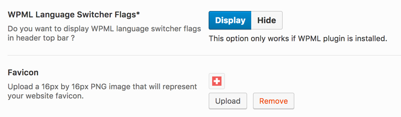
5. Do not worry about lots of un-translated things in header, footer and content area. You will learn to translate those one by one.

### Duplicate News Page

1. Go to **Pages** on Dashboard side and look for **News** Page
2. Duplicate it the same way we duplicated home page. ( As explained above )
3. Edit the duplicated news page and provide it translated title. As displayed below.
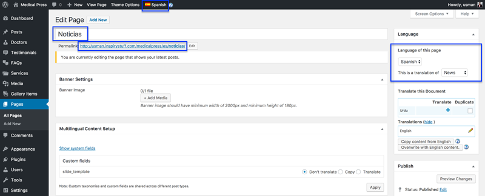
4. Update the page after editing.

    
### Update Reading Settings

After creating Translated Pages for Home and news Go to **Dashboard &gt Settings &gt Reading** and configure the translated pages as **Front Page** and **Posts Page**.
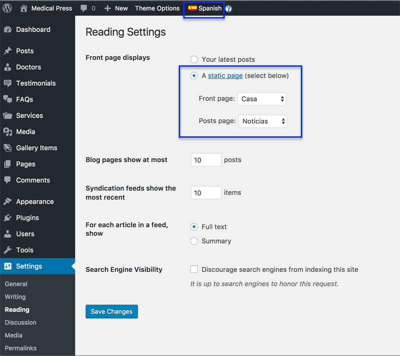

## Menus Sync

1. To setup language specific menus, Go to **Dashboard &gt WPML &gt WPML Menus Sync**

2. Click the **Sync** button.

3. Select the pages that you have translated + the Main Menu translation to other language.
Press **Apply Changes** and wait for the menus to be synced.
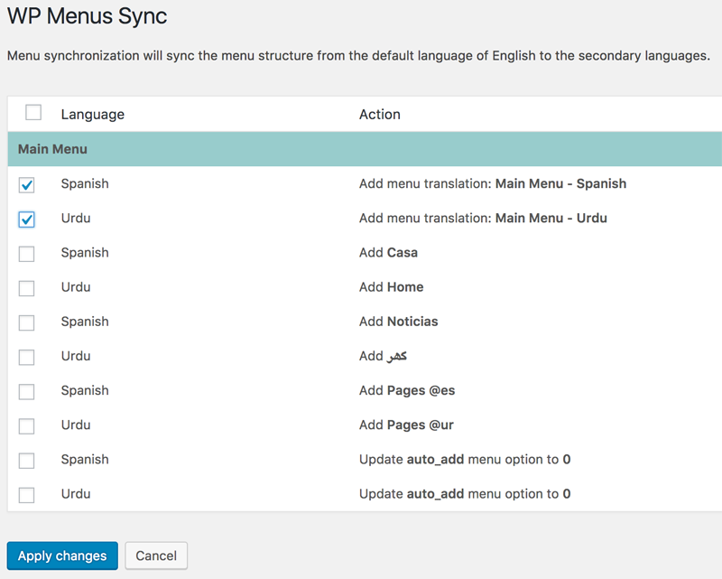

4. Once syncing is complete, visit the home page in other language and you will see that translated menu will appear in place of English menu.
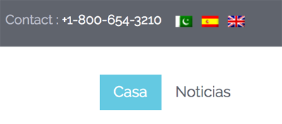

## String Translation
You can translate a string that does not exist in post, pages and taxonomies using **Dashboard &gt WPML &gt String Translation** section.
String Translation Example

1. We will learn how to translate tagline, which is "**Just another WordPress site**" for this example.
Go to **Dashboard** &raquo; **WPML** &raquo; **String Translation** section and search for "**Just another WordPress site**".

2. Once found, translate it as displayed below.

3. Then search for the top header text "**Welcome to MedicalPress a Premium Medical Theme**" and translate it as displayed below.
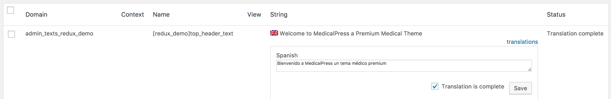

4. Now check the front end of your website in other language and you will have the top header text "**Welcome to MedicalPress a Premium Medical Theme**" translated.
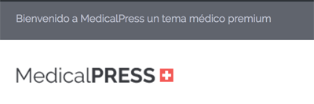

5. So, you can translate all the strings in this section according to each language.